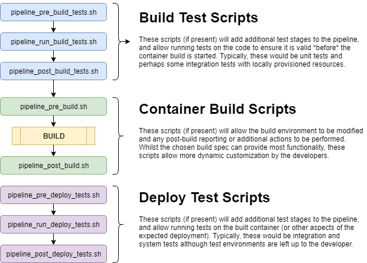

# Crown Commercial AWS Environment #

## Developer Guide ##

Version 1.

## DRAFT #

## Rowe IT ##

## October 2018 ##

Table of Contents 
=================

* [Overview](#overview)

  * [Pre-requisites & Assumptions](#pre-requisites-assumptions)

* [GitHub Repository Layout](#github-repository-layout)

  * [Required](#required)

  * [Optional](#optional)

    * [Files](#files)

    * [Scripts](#scripts)

* [Provided Variables](#provided-variables)

  * [Provisioning Pre-Defined Keys](#provisioning-pre-defined-keys)

  * [Build Pre-Defined Keys](#build-pre-defined-keys)

  * [Configurable](#configurable)

* [Build & Deployment Details](#build-deployment-details)

  * [Provided Build Environments](#provided-build-environments)

  * [Language Support](#language-support)

  * [Provisioning options](#provisioning-options)

 Overview
=========

This basic guide provides infrastructure and environment information for developing an API or application that is to be incorporated within the Crown Commercial Service build/deployment platform. The platform utilises several Amazon Web Services (AWS) offerings, with those of most interest to developers being CodeBuild[^1], CodePipeline[^2] and Elastic Container Service[^3].

Pre-requisites & Assumptions
----------------------------

The application will run as a container (docker) and the developers should understand the principles and implications of this choice.
Developers will be responsible for maintaining the 'runtime' Dockerfile and will require a strong understanding of the environment which the application requires.

GitHub Repository Layout
========================

Required
--------

There must be a *Dockerfile*[^4] within the root of the repository as this will be used to create the container that will subsequently be deployed within AWS ECS. The container must expose port 8080. The cluster load balancer will route requests to the container based on the host name used in the request.

Optional
--------

There are a number of optional scripts and/or files that may also be provided within the root of the repository, allowing additional
flexibility and customisation of the build process:

### Files

**CCS_VERSION** &#8211; This file should contain a single line
of text that represents the version of the code, ideally following
semantic versioning as a best practice. Examples may be:

> **1.0.4-SNAPSHOT**
>
> **1.4.5**
>
> **2.0.0-BETA**

This text will be promoted into the build environment as a variable (CCS_VERSION), into the docker image as a label, and also used as a tag for the docker image when it is pushed into the AWS repository.

### Scripts

Provided Variables
==================

There are several environment variables that are available within the build environment and further propagated into the built container. Some are pre-defined when an application is provisioned by operations, and do not change unless re-provisioning occurs. Some are pre-defined in the sense that the keys are determined by the infrastructure code, but the values are determined at build time. Others are configurable such that both the keys and values are obtained from the AWS Parameter Store[^5] (although both become fixed at build time).

Provisioning Pre-Defined Keys
-----------------------------

CCS_APP_BASE_URL &#8211; The base domain within which applications are reachable.

CCS_APP_PROTOCOL &#8211; The protocol (HTTP/HTTPS) that the applications use.

CCS_API_BASE_URL &#8211; The base domain within which APIs are reachable.

CCS_API_PROTOCOL &#8211; The protocol (HTTP/HTTPS) that the APIs use.

CCS_DEFAULT_DB_URL &#8211; The JDBC connection URL for the default RDS database.

CCS_DEFAULT_DB_TYPE &#8211; The type (postgresql etc.) of the default RDS database.

CCS_DEFAULT_DB_HOST &#8211; The fully-qualified host of the default RDS database.

CCS_DEFAULT_DB_PORT &#8211; The port that the default RDS database listens on.

CCS_DEFAULT_DB_NAME &#8211; The database name for the default RDS
database.

CCS_DEFAULT_DB_USER &#8211; The access user for the default RDS database.

CCS_DEFAULT_DB_PASSWORD &#8211; The access password for the default RDS database.

CCS_DEFAULT_ES_ENDPOINT &#8211; The ElasticSearch endpoint for the default ES instance.

Build Pre-Defined Keys
----------------------

GIT_OWNER &#8211; The GitHub owner of the code being built (e.g.
*Crown-Commercial-Service*).

GIT_REPO &#8211; The GitHub repository that the code is held within (e.g. *CMpDevEnvironment*).

GIT_BRANCH &#8211; The git branch within the repository that is being built. This defaults to *master*.

GIT_COMMIT &#8211; The commit hash (40-character string) of the code being built.

BUILD_TIME &#8211; The time (Unix Timestamp) that the build was started (e.g. 1539764489854).

Configurable
------------

Any number of build-time Environment variables can be injected into the
container by registering AWS Parameter Store variables within an
appropriate location:

/Environment/*\<prefix\>*/*\<name\>*/*\<key\>*

where the location values are as follows:

*\<prefix\>*: The container prefix that was specified when the component was provisioned.

*\<name\>*: The container name that was specified when the component was provisioned.

*\<key\>*: The Environment variable name to set (e.g.
CCS_RELEASE_TAG).

The value of the parameter that is stored at this location will
automatically be propagated into the container at build time, allowing the application to access it as any other Environment variable.

NB: This does mean that anyone able access the container will be able to view the data and as such, any data that is particularly sensitive should be acquired by the application directly and not passed using this mechanism.

Build & Deployment Details
==========================

Provided Build Environments
---------------------------

There are several supported environments for building the application containers, allowing for additional functionality within the build (external to the container) and test capabilities.

The current choices are based upon the AWS provided CodeBuild images[^6] and they can be found within the CMpDevEnvironment[^7] GitHub repository as *\<type\>_buildspec.yml* files, where *\<type\>* is one of the choices.

Custom build environment container images may also be used, if they are visible to the AWS CodeBuild/CodePipeline services, although additional support (a suitable *\<type\>_buildspec.yml* file along with build module changes are required) would need to be provided.

Language Support
----------------

As mentioned above with respect to the environments, various languages are available. Java[^8], Ruby[^9] and Python[^10] have been tested at a basic level within example applications.

Provisioning options
--------------------

When an application or API is provisioned, there are several parameters that can be provided within the Terraform[^11] variables that will adjust the provisioning options. These are defined within the component module and as the definitive list is found within the CMpDevEnvironment[^12] GitHub repository. Some of the most useful options are as follows:

*name* &#8211; The (short) name of the component (e.g. app1)

*build_type* &#8211; The type of build to perform (e.g. ruby, docker, java, python, custom)

*build_image* &#8211; The ECR image to use, if the *build_type* is set to **custom**

*github_owner* &#8211; The GitHub owner of the source code for the component.

*github_repo* &#8211; The GitHub repository that holds the source code for the component.

*task_count* &#8211; The default number of containers that should run when deployed.

These options are set (and will only change) when provisioning is
(re)run via terraform and are not dynamically configurable at build time.

Custom Build Environments
---------------------------

It is possible to create custom container images for bespoke build environments allow more flexible options (and more up-to-date image than AWS CodeBuild may provide).

By creating a GitHub repository containing (at the very least) a Dockerfile and a new *build* project within the CMpDevEnvironment[^13] that specifies a *build_type* of **image**, a custom container image can be build and subsequently referenced within another build project using a *build_type* of **custom** and a *build_image* of **{prefix}/{name}** taken from the image project.

For example, building the image within the *image-ruby*[^14] project would allow another project to use that image with a *build_type* of **custom** and a *build_image* of **ccs/ruby**

As with other builds, if a **CCS_VERSION** file is found within the image repository, the image will be tagged with the version number found in that file. When using a **custom** *build_type*, it is also possible to specify the *build_image_version* variable (which will default to **latest**) to choose a specific version-tagged image, allowing for a more controlled release process.

[^1]: <https://aws.amazon.com/codebuild/>

[^2]: <https://aws.amazon.com/codepipeline/>

[^3]: <https://aws.amazon.com/ecs/>

[^4]: <https://docs.docker.com/engine/reference/builder/>

[^5]: <https://docs.aws.amazon.com/systems-manager/latest/userguide/systems-manager-paramstore.html>

[^6]: <https://docs.aws.amazon.com/codebuild/latest/userguide/build-env-ref-available.html>

[^7]: <https://github.com/Crown-Commercial-Service/CMpDevEnvironment/tree/production/terraform/modules/build>

[^8]: <https://github.com/Crown-Commercial-Service/CMpExampleApi1>

[^9]: <https://github.com/Crown-Commercial-Service/CMpExampleApp2>

[^10]: <https://github.com/Crown-Commercial-Service/CMpExampleApi2>

[^11]: <https://www.terraform.io/>

[^12]: <https://github.com/Crown-Commercial-Service/CMpDevEnvironment/blob/production/terraform/modules/component/variables.tf>

[^13]: https://github.com/Crown-Commercial-Service/CMpDevEnvironment/tree/production/terraform/build

[^14]: https://github.com/Crown-Commercial-Service/CMpDevEnvironment/tree/production/terraform/build/image-ruby