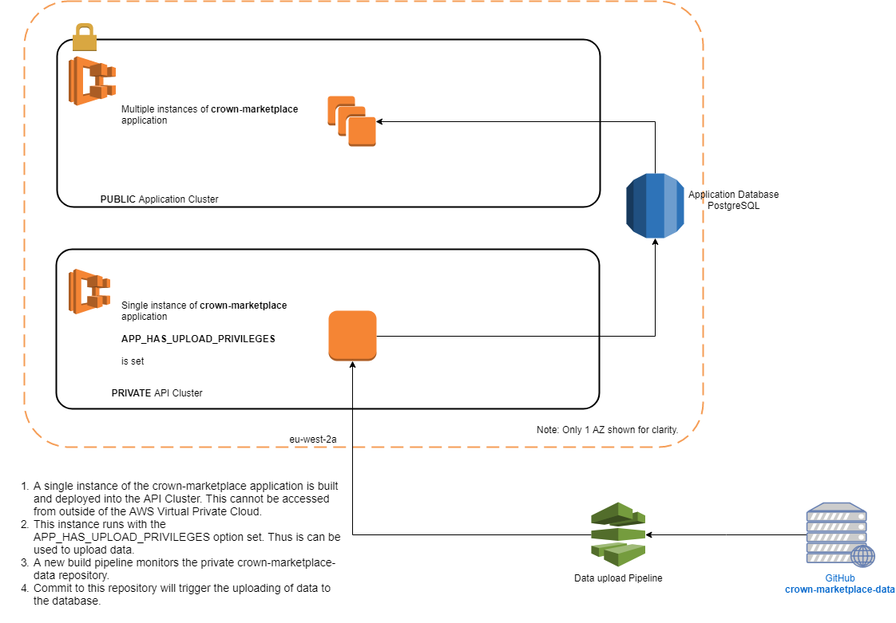

# Crown Commercial AWS Environment #

## Phase 2.2 Setup ##

Version 1.

## DRAFT #

## Rowe IT ##

## October 2018 ##

---

# Table of Contents #

- [CCSDEV AWS Environment](#ccsdev-aws-environment)
- [Setting up CCSDEV on a new AWS Account](#setting-up-ccsdev-on-a-new-aws-account)
   - [Assumptions](Assumptions)
   - [Public Domain/Sub-domain Definition](#public-domain/sub-domain-definition)
   - [Creating System Administration account](#creating-system-administration-account)
      - [Setting Terraform credentials](#setting-terraform-credentials)
      - [Setting AWS CLI credentials](#setting-aws-cli-credentials)
   - [Configuring Terraform shared state](#configuring-terraform-shared-state)
      - [Configuring on an account for the first time](#configuring-on-an-account-for-the-first-time)
      - [Configuring on an account for an additional checkout](#configuring-on-an-account-for-an-additional-checkout)
   - [Defining IAM Groups, polices etc](#defining-iam-groups,-polices-etc)
   - [Create EC2 Key Pairs](#create-ec2-key-pairs)
   - [Creating Infrastructure](#creating-infrastructure)
   - [Setting GitHub Access Token](#setting-github-access-token)
   - [Setting NPM Access Token](#setting-npm-access-token)
   - [Defining additional parameter store entries](#defining-additional-parameter-store-entries)
   - [Creating Marketplace Application build pipelines](#creating-marketplace-application-build-pipelines)
   - [Creating example application and API build pipelines](#creating-example-application-and-api-build-pipelines)


- [Appendix 1 - Diagrams](#appendix-1---diagrams)
   - [Core AWS Infrastructure](#core-aws-infrastructure)
   - [ECS Clusters](#ecs-clusters)
   - [App and Api Build Pipelines](#app-and-api-build-pipelines)
   - [Data Upload Build Pipelines](#data-upload-build-pipelines)

---

# CCSDEV AWS Environment #

The environment provides two AWS Elastic Container Service (ECS) clusters within a Virtual Private
Cloud (VPC), one for `applications` and the other for `apis`. Load balancers are created to access
deployed containers within the clusters. Example application and apis are provided along with
corresponding AWS CodePipeline/Codebuild definitions.

Instances of an RDS Postgres databases and Elastic Search instances are also created when required. Note that Elastic Search is not currently being used by any applications or APIs so is not created by default..

All of the required AWS assets are created using Terraform scripts except for SSH ‘key pairs’ and a
public hosted zone with the Route 53 DNS service.

> NOTE: This version makes use of Terraform ‘shared state’ that is stored in an S3 bucket,
concurrent access is controlled using a Dynamo DB table^1. This allows the scripts to be
executed from different systems and with different AWS users. This does introduce
some additional complexity. See https://www.terraform.io/docs/backends/types/s3.html

This document explains how to execute these scripts on a new AWS account. Some familiarity with
AWS and Git is assumed.

Several GitHub repositories are involved, each repository contains its own summary and some
specific instructions.

`CMpDevEnvironment` : 
This contains all the Terraform scripts used for building the AWS Infrastructure and the build
pipelines for the example applications. It also contains definitions of several AWS IAM
security groups and policies.

There are number of important branches in this repository:

 - `master` : The latest release and is used directly in development and test environments.
 - `production` : The latest release within any production environment specific changes.
 - `develop` : Used for ongoing development of the Terraform scripts.
 
 Other feature branches are used as required.

## Production Application Repositories ##

These repositories are required to build and deploy a working Marketplace application.

`CMpDevBuildImage_Ruby` : 
This contains a Dockerfile for creating a new build image that can be used by AWS Codebuild. This may be required when AWS to not provide a suitable build environment. For example, at present Ruby 2.5.3 is not supported by AWS.

`crown-marketplace` :
This contains the actual Marketplace application. It is used by two build pipelines, one to deploy it as as an application accessible from the public Internet and one to deploy a single instance as an 'API' with restricted access for the uploading of data.

`crown-marketplace-data` :
This is a *private* repository. It contains scripts for building data files in `JSON` format relating to different frameworks. These data files contain the data that is actually uploaded to the Marketplace application.

`CMpDevEnvironment_Private` :
This is a *private* repository. It contains Terraform configuration files used for the development, test and production environments. These files will define any IP restrictions relating to each environment. This repository also contains load testing scripts relating to the Marketplace application.

## Example Application and API Repositories ##

These repositories contain example applications and APIs implemented using various technologies. **They must NOT be deployed to any system accessible from the public Internet without any IP restrictions.**

`CMpExampleNPMModule` :
This contains an example NPM module that is referenced by the corresponding build/npm
example pipeline.

`CMpExampleApi1` :
This contains an example api implemented using Java and Springboot. It is referenced by
the corresponding build/api1 example pipeline.

`CMpExampleApp1` : 
This contains an example application implemented using nodeJS and Express. It is
referenced by the corresponding build/app1 example pipeline. This example project uses the
example NPM module and the GOV UK frontend toolkit.

`CMpExampleApi2` : 
This contains an example api implemented using Python and Flask. It is referenced by the
corresponding build/api2 example pipeline.

`CMpExampleApp2` : 
This contains an example application implemented using Ruby on Rails. It is referenced by
the corresponding build/app2 example pipeline. This example project uses the example
NPM module and the GOV UK frontend toolkit.

# Setting up CCSDEV on a new AWS Account #

## Assumptions ##

- You have access to a new AWS account and access to the root credentials or an IAM user
that allows the creation of IAM groups and policies.
- You have a public domain or sub-domain that can be defined in the Route 53 services.
- You have knowledge of the IP addresses that should be allowed access.
- Git installed.
- You have access to a github and have or can generate an access token.
- Terraform is installed (https://www.terraform.io/).
- The AWS CLI (https://aws.amazon.com/cli/) is useful but not required.
- To build and publish the example npm modules you will need an account and access token
for npm
- The CCSDEV environment repository is checked out from github at(https://github.com/Crown-Commercial-Service/CMpDevEnvironment). 

## Determining correct `CMpDevEnvironment` branch ##

It is import that the correct branch of the `CMpDevEnvironment` is used. This is selected using the `git checkout` command.

- Development : `git checkout master`
- Test : `git checkout master`
- Production : `git checkout production`

 If there is any doubt about the local checkout being up to date then the `git pull origin <branch name>` should be used.

## Public Domain/Sub-domain Definition ##

Login using the root credentials and create a hosted zone in Route 53 for your public domain or sub-
domain.

The domain/sub-domain will need to be specified when creating ‘app’ build pipelines and A records
will be generated for each new application. For example, if you define ‘mydomain.co.uk’, and then
deploy the example application ‘app1’ an A record for ‘app1.mydomain.co.uk’ will be added to the
hosted zone. The record will point at the application cluster load balancer.

## Creating System Administration account ##

This is the creation of an AWS IAM account that can run the initial Terraform scripts.

1. Login to the AWS account using the root credentials.
2. Select the IAM service
3. Create a new user, the name doesn’t matter but in the rest of this document it is
assumed to be called `sysadmin`, select `Programmatic access` and `AWS Management
Console access` options.
4. Attach the `IAMFullAccess` policy to this user.
5. Having created the user extract and save the access key and secret key.
6. Make these keys available to Terraform and (if installed) the AWS CLI.

Terraform will look for the keys in certain environment variables, if these are not defined it will look
for the default credentials associated with the AWS CLI.

### Setting Terraform credentials ###

From the command prompt used to run Terraform scripts set the `AWS_ACCESS_KEY_ID` and
`AWS_SECRET_ACCESS_KEY` environment variables.


### Setting AWS CLI credentials ###

From the command prompt used to run Terraform scripts run the command ‘aws configure’
and follow the prompts. The region should be set to `eu-west-2`

## Configuring Terraform shared state ##

This uses the Terraform scripts in `terraform/bootstrap`.

These scripts will perform three different functions:

1. Ensure that the AWS user corresponding to the access keys used is given privileges to create
    the S3 and Dynamo DB table.
2. Create the required S3 buckets and Dynamo DM table.
3. Initialise the Terraform backend configuration in the current git checkout.

There are a couple of potential issues:


- The first function does not take effect immediately and can cause the subsequent steps to
fail.
- The second function will only succeed the first time the scripts are executed for a given AWS
account.

These can result in Terraform errors being displayed and the need to execute the scripts multiple
times.

The third function will result in a series of `backend.tf` being generated in the `security`,
`infrastructure` and various `build/app` and `build/api` folders.

> NOTE: This approach is an attempt to avoid to the need to manually pre-create certain
assets in AWS and distribute the Terraform backend files.


### Configuring on an account for the first time ###

1. Ensure the AWS access keys are configured as described previously.
2. Ensure the command prompt is open in the `bootstrap` directory.
3. Run `terraform init` to install and configure the required providers.
4. If there is an error, wait a few seconds and execute the `init` command again.
5. Run `terraform apply`.
6. If there is an error, wait a few seconds and execute the `apply` command again.
7. Enter `yes` when prompted.
8. If there is an error, wait a few seconds and execute the `apply` command again.

If the S3 service is inspected from AWS console there will be a bucker with a name in the form
`ccs.<AWS account number>.tfstate`. This is where the Terraform state information will
be held. Within Dynamo DB there will also be a new table `terraform_state_lock`.

### Configuring on an account for an additional checkout ###

This applies even if the same AWS user is executing the scripts on a new checkout. The steps are the
same but there will be errors because the S3 bucket and Dynamo DB table already exists.

## Defining IAM Groups, polices etc ##

This uses the Terraform scripts in `terraform/security`.

It will create several IAM user groups and policy definitions. The AWS user corresponding to the
access keys used will be automatically added to all of these groups.

1. Ensure the AWS access keys are configured as described previously.
2. Ensure the command prompt is open in the `security` directory.
3. Run `terraform init` to install and configure the required providers.
4. Run `terraform apply`.
5. Enter `yes` when prompted.

You now have an IAM user, `sysadmin` capable of administering all aspects of the CCSDEV
environment on AWS. It can take a few minutes for these changes to take effect. So, a short pause
before proceeding is recommended.

## Create EC2 Key Pairs ##

AWS EC2 instances require a ‘key Pair’ to define public and private keys for SSH access to the
servers. These key pairs need to be created manually and MUST be saved in a secure location.

1. Logon to the AWS console using the `sysadmin` user.
2. Select the `EC2` service
3. Select `Key Pairs` in the `Network & Security` section.
4. Create a key pair called `ccs_bastion` and save it in a secure location.
5. Create a key pair called `ccs_cluster` and save it in a secure location.

It is possible to use different names, but this will require changes to Terraform variables at a later
stage.

## Creating Infrastructure ##

This uses the Terraform scripts in terraform/infrastructure.

You will need to create a file ending with `.auto.tfvars` in this directory.
`cmpdev.auto.tfvars` is suggested. An example file can be copied from
`config.auto.tfvars.example`.

The typical settings for development to cmpdev.crowncommercial.gov.uk are shown below:

```
"ssh_access_cidrs" = {
    "office" = "192.0.2.0/24"
}
"app_access_cidrs" = {
    "office" = "192.0.2.0/24"
    "guests" = "198.51.100.0/24"
}
domain_name = "service.crowncommercial.gov.uk"
domain_internal_prefix = "internal"
enable_https = true
```

> Note that this file should not be stored in a public GitHub repository. Files for existing environment
can be found within a private [config repository](https://github.com/Crown-Commercial-Service/CMpDevEnvironment_Private)
and it is best practice to add additional environments into this repository to ensure a common configuration.


1. Ensure the AWS access keys are configured as described previously.
2. Ensure the command prompt is open in the `infrastructure` directory.
3. Run `terraform init` to install and configure the required providers.
4. Run `terraform apply`.
5. Enter `yes` when prompted.
6. The infrastructure will now be created. This can take a while, particularly the RDS and
Elastic Search instances.

The core infrastructure is now available. This will include a VPC, small bastion host, two ECS clusters
for ‘Apps’ and ‘Apis’, and RDS database and Elastic Search domain. A simple Dashboard is also
defined in the CloudWatch service.

> Note: The intention is that the RDS and Elastic search instances can only be accessed from
within the private VPC subnets, thus the API cluster only. However, to assist with the
early development sprints they are currently available from within the public subnets.

## Setting GitHub Access Token ##

The build pipe lines require access to GitHub. This is controlled via a token; these tokens are stored
in the AWS EC2 Parameter store.

A default token must be added before creating any build pipelines.

Create a `secure string` entry in the EC2 Parameter store called `ccs-build_github_token` that
contains the GitHub token.

It is possible to define different tokens for different applications and APIs.

## Setting NPM Access Token ##

> Note: No NPM modules are being build for use with the Marketplace application at present. An NPM token is only required if using the example NPM module project. Thus in most cases this is not required.

The NPM module example build pipeline requires access to the NPM repository site. This is
controlled via a token; these tokens are stored in the AWS EC2 Parameter store.

A token must be added because the NPM pipeline example can be created.

Create a `secure string` entry in the EC2 Parameter store called `ccs-build_npm_token` that
contains the NPM token.

## Defining additional parameter store entries ##

Some application and Api build pipelines may require additional environment variables passed to the
running containers. For example, a Google API key.

These can be defined in the EC2 Parameter store as follows:

`/Environment/ccs/{app or api name}/{variable name}`

To create an environment variable called TEST_VAR for the ‘app1’ example the following Parameter
store entry should be added: `/Environment/ccs/app1/TEST_VAR`.

It is also possible to define global environment variables that will be passed to all containers.

These can be defined in the EC2 Parameter store as follows:

`/Environment/global/{variable name}`

### Marketplace Application Environment Variables ###
The Marketplace application required a number of variables to be set. These are documented in the `crown-marketplace` repository but include:

- GOOGLE_GEOCODING_API_KEY
- GA_TRACKING_ID
- SECRET_KEY_BASE
- HTTP_BASIC_AUTH_NAME
- HTTP_BASIC_AUTH_PASSWORD
- SUPPLY_TEACHERS_COGNITO_ENABLED
- DFE_SIGNIN_URL
- DFE_SIGNIN_CLIENT_ID
- DFE_SIGNIN_CLIENT_SECRET
- DFE_SIGNIN_REDIRECT_URI
- DFE_SIGNIN_WHITELISTED_EMAIL_ADDRESSES

**These should all be created in the EC2 parameter store before attempting to create the build pipelines.**

> Note: Various AWS Cognito variables are configured automatically by the Terraform scripts and do not need to be configured manually.

There are two build pipeline for the Marketplace application, one for the actually application and one as an API for uploading data. In the EC2 parameter store environment variables for these will have the prefix and `/Environment/ccs/cmp/` and `/Environment/ccs/cmpupload/`. **Currently the environment variables must be defined for BOTH.**

## Creating Marketplace Application build pipelines ##

### Creating Ruby build pipeline ###

This uses the Terraform scripts in `terraform/build/image-ruby`.

It will create a build pipe line for an AWS build image called 'ccs/ruby'. Once build this will result in a new AWS Build image that can be specified by other applications or APIs.

1. Ensure the AWS access keys are configured as described previously.
2. Ensure the GitHub token is stored in the parameter store.
3. Ensure the command prompt is open in the `build/image-ruby` directory.
4. Run `terraform init` to install and configure the required providers.
5. Run `terraform apply`.
6. Enter `yes` when prompted.
7. The `ruby-pipeline` build pipe line will now be created. This can take a while.
8. Once built the the resulting images can be specified in an applications or APIs Terraform using the 'build_image' setting.

> Note: This pipeline should be created and allowed to execute before deploying any of the other pipelines.

### Creating Marketplace Application build pipeline ###

This uses the Terraform scripts in `terraform/build/crown-marketplace`.

It will create a build pipe line for the main Crown Marketplace application.

1. Ensure the AWS access keys are configured as described previously.
2. Ensure the GitHub token is stored in the parameter store.
3. Ensure that all the required environment variables are defined in the EC2 parameter store for the application `cmp`.
4. Ensure the command prompt is open in the `build/crown-marketplace` directory.
5. Run `terraform init` to install and configure the required providers.
6. Run `terraform apply`.
7. Enter `yes` when prompted.
8. The `cmp-pipeline` build pipeline will now be created. This can take a while.
9. Once built the application will be deployed and can be accessed on the correct URL for the environment, for example, `marketplace.service.crowncommercial.gov.uk` in the production environment.

### Creating Marketplace data upload API build pipeline ###

This uses the Terraform scripts in `terraform/build/crown-marketplace-upload`.

It will create a build pipe line for the Crown Marketplace application into the API Cluster with the data upload capability enabled.

1. Ensure the AWS access keys are configured as described previously.
2. Ensure the GitHub token is stored in the parameter store.
3. Ensure that all the required environment variables are defined in the EC2 parameter store for the application `cmpupload`.
4. Ensure the command prompt is open in the `build/crown-marketplace-upload` directory.
5. Run `terraform init` to install and configure the required providers.
6. Run `terraform apply`.
7. Enter `yes` when prompted.
8. The `cmpupload-pipeline` build pipeline will now be created. This can take a while.

### Creating Marketplace supply teacher data upload pipeline ###

This uses the Terraform scripts in `terraform/build/upload-supply-teacher-data`.

It will create a build pipe line for uploading supply teacher data to the application.

1. Ensure the AWS access keys are configured as described previously.
2. Ensure the GitHub token is stored in the parameter store.
3. Ensure the command prompt is open in the `build/upload-supply-teacher-data` directory.
4. Run `terraform init` to install and configure the required providers.
5. Run `terraform apply`.
6. Enter `yes` when prompted.
7. The `upload-supply-teacher-pipeline` pipe line will now be created.

## Creating example application and API build pipelines ##

These build pipelines should only be created in a development environment. **They must NOT be deployed to any system accessible from the public Internet without any IP restrictions.**

### Creating ‘App1’ build pipeline ###

This uses the Terraform scripts in `terraform/build/app1`.

It will create a build pipe line for an example ‘app’ called ‘app1’.

The contents of the `main.tf` file may need to be reviewed if creating a pipeline for a branch other
than `master`.

1. Ensure the AWS access keys are configured as described previously.
2. Ensure the GitHub token is stored in the parameter store.
3. Ensure the command prompt is open in the `build/app1` directory.
4. Run `terraform init` to install and configure the required providers.
5. Run `terraform apply`.
6. Enter `yes` when prompted.
7. The example `app1` build pipe line will now be created. This can take a while.

This will result in a build pipe line being created and, eventually, the example `app1` being deployed
into the `app` cluster.

### Creating ‘App2’ build pipeline ###

This uses the Terraform scripts in `terraform/build/app2`.

It will create a build pipe line for an example ‘app’ called ‘app2’.

The contents of the `main.tf` file may need to be reviewed if creating a pipeline for a branch other
than `master`.

1. Ensure the AWS access keys are configured as described previously.
2. Ensure the GitHub token is stored in the parameter store.
3. Ensure the command prompt is open in the `build/app2` directory.
4. Run `terraform init` to install and configure the required providers.
5. Run `terraform apply`.
6. Enter `yes` when prompted.
7. The example `app2` build pipe line will now be created. This can take a while.

This will result in a build pipe line being created and, eventually, the example `app2` being deployed
into the `app2 cluster.

### Creating ‘Api1’ build pipeline ###

This uses the Terraform scripts in `terraform/build/api1`.

It will create a build pipe line for an example ‘api’ called ‘api1’.

The contents of the `main.tf` file may need to be reviewed if creating a pipeline for a branch other
than `master`.

1. Ensure the AWS access keys are configured as described previously.
2. Ensure the GitHub token is stored in the parameter store.
3. Ensure the command prompt is open in the `build/api1` directory.
4. Run `terraform init` to install and configure the required providers.
5. Run `terraform apply`.
6. Enter `yes` when prompted.
7. The example `api1` build pipe line will now be created. This can take a while.

This will result in a build pipe line being created and, eventually, the example `api1` being deployed
into the `api` cluster.

### Creating ‘Api2’ build pipeline ###

This uses the Terraform scripts in `terraform/build/api2`.

It will create a build pipe line for an example ‘api’ called ‘api2’.

The contents of the `main.tf` file may need to be reviewed if creating a pipeline for a branch other
than `master`.

1. Ensure the AWS access keys are configured as described previously.
2. Ensure the GitHub token is stored in the parameter store.
3. Ensure the command prompt is open in the `build/api2` directory.
4. Run `terraform init` to install and configure the required providers.
5. Run `terraform apply`.
6. Enter `yes` when prompted.
7. The example `api2` build pipe line will now be created. This can take a while.

This will result in a build pipe line being created and, eventually, the example `api2` being deployed
into the `api` cluster.

### Creating ‘Npm’ build pipeline ###

This uses the Terraform scripts in `terraform/build/npm1`.

It will create a build pipe line for an example NPM module called ‘npm1’.

1. Ensure the AWS access keys are configured as described previously.
2. Ensure the GitHub token is stored in the parameter store.
3. Ensure the `ccs-build_npm_token` value is defined in the EC2 Parameter store.
4. Ensure the command prompt is open in the `build/npm1` directory.
5. Run `terraform init` to install and configure the required providers.
6. Run `terraform apply`.
7. Enter `yes` when prompted.
8. The example `npm1` build pipe line will now be created. This can take a while.

# Appendix 1 - Diagrams #

## Core AWS Infrastructure ##


## ECS Clusters ##


## App and Api Build Pipelines ##


## Data Upload Build Pipelines ##

