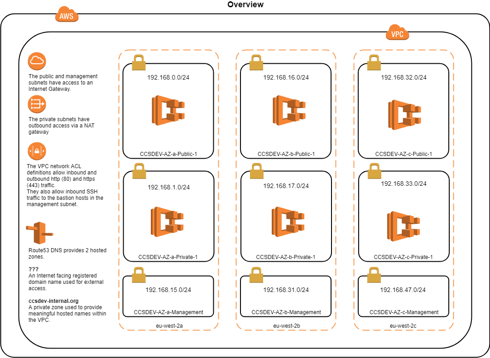
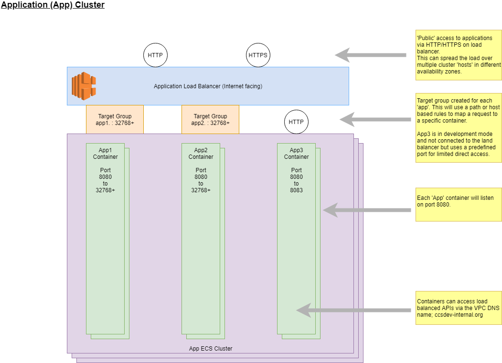
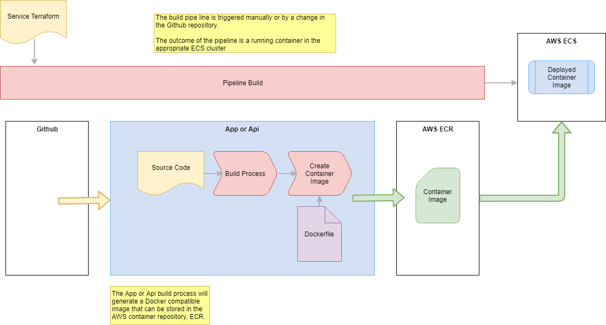

# Crown Commercial AWS Environment #

## Production Setup ##

Version 1.

## DRAFT #

## Rowe IT ##

## November 2018 ##

---

# Table of Contents #

- [CCSDEV AWS Environment](#ccsdev-aws-environment)
- [Setting up CCSDEV on a new AWS Account](#setting-up-ccsdev-on-a-new-aws-account)
   - [Assumptions](Assumptions)
   - [Public Domain/Sub-domain Definition](#public-domain/sub-domain-definition)
   - [Creating System Administration account](#creating-system-administration-account)
      - [Setting Terraform credentials](#setting-terraform-credentials)
      - [Setting AWS CLI credentials](#setting-aws-cli-credentials)
   - [Configuring Terraform shared state](#configuring-terraform-shared-state)
      - [Configuring on an account for the first time](#configuring-on-an-account-for-the-first-time)
      - [Configuring on an account for an additional checkout](#configuring-on-an-account-for-an-additional-checkout)
   - [Defining IAM Groups, polices etc](#defining-iam-groups,-polices-etc)
   - [Create EC2 Key Pairs](#create-ec2-key-pairs)
   - [Creating Infrastructure](#creating-infrastructure)
   - [Setting GitHub Access Token](#setting-github-access-token)
   - [Defining additional parameter store entries](#defining-additional-parameter-store-entries)
   - [Creating Custom Ruby build image pipeline](#creating-‘custom-ruby-build-image’-build-pipeline)
   - [Creating Marketplace application build pipeline](#creating-‘production-marketplace-application’-build-pipeline)
- [Appendix 1 - Diagrams](#appendix-1---diagrams)
   - [Core AWS Infrastructure](#core-aws-infrastructure)
   - [ECS Clusters](#ecs-clusters)
   - [App and Api Build Pipelines](#app-and-api-build-pipelines)

---

# CCSDEV AWS Environment #

The environment provides two AWS Elastic Container Service (ECS) clusters within a Virtual Private
Cloud (VPC), one for `applications` and the other for `apis`. Load balancers are created to access
deployed containers within the clusters. Example application and apis are provided along with
corresponding AWS CodePipeline/Codebuild definitions.

Example instances of an RDS Postgres databases and Elastic Search instances are created.

All of the required AWS assets are created using Terraform scripts except for SSH ‘key pairs’ and a
public hosted zone with the Route 53 DNS service.

> NOTE: This version makes use of Terraform ‘shared state’ that is stored in an S3 bucket,
concurrent access is controlled using a Dynamo DB table^1. This allows the scripts to be
executed from different systems and with different AWS users. This does introduce
some additional complexity. See https://www.terraform.io/docs/backends/types/s3.html

This document explains how to execute these scripts on a new AWS account. Some familiarity with
AWS and Git is assumed.

Several GitHub repositories are involved, each repository contains its own summary and some
specific instructions.

`CMpDevEnvironment` : 
This contains all the Terraform scripts used for building the AWS Infrastructure and the build
pipelines for the example applications. It also contains definitions of several AWS IAM
security groups and policies.

`crown-marketplace` : 
This contains the actual Marketplace application. This is a Ruby application that is built using the custom build image defined in the `CMpDevBuildImage_Ruby` repository.

`CMpDevBuildImage_Ruby` : 
This contains a Dockerfile for creating a new build image that can be used by AWS Codebuild. This may be required when AWS to not provide a suitable build environment. For example, at present Ruby 2.5.3 is not supported by AWS.


# Setting up CCSDEV on a new AWS Account #

## Assumptions ##

- You have access to a new AWS account and access to the root credentials or an IAM user
that allows the creation of IAM groups and policies.
- You have a public domain or sub-domain that can be defined in the Route 53 services.
- You have knowledge of the IP addresses that should be allowed access.
- Git installed.
- You have access to a github and have or can generate an access token.
- Terraform is installed (https://www.terraform.io/).
- The AWS CLI (https://aws.amazon.com/cli/) is useful but not required.
- To build and publish the example npm modules you will need an account and access token
for npm
- The CCSDEV environment repository is checked out from github at(https://github.com/Crown-Commercial-Service/CMpDevEnvironment). For production use the `production` branch must be checked out.


## Public Domain/Sub-domain Definition ##

Login using the root credentials and create a hosted zone in Route 53 for your public domain or sub-
domain.

The domain/sub-domain will need to be specified when creating ‘app’ build pipelines and A records
will be generated for each new application. For example, if you define ‘mydomain.co.uk’, and then
deploy the example application ‘app1’ an A record for ‘app1.mydomain.co.uk’ will be added to the
hosted zone. The record will point at the application cluster load balancer.

## Creating System Administration account ##

This is the creation of an AWS IAM account that can run the initial Terraform scripts.

1. Login to the AWS account using the root credentials.
2. Select the IAM service
3. Create a new user, the name doesn’t matter but in the rest of this document it is
assumed to be called `sysadmin`, select `Programmatic access` and `AWS Management
Console access` options.
4. Attach the `IAMFullAccess` policy to this user.
5. Having created the user extract and save the access key and secret key.
6. Make these keys available to Terraform and (if installed) the AWS CLI.

Terraform will look for the keys in certain environment variables, if these are not defined it will look
for the default credentials associated with the AWS CLI.

### Setting Terraform credentials ###

From the command prompt used to run Terraform scripts set the `AWS_ACCESS_KEY_ID` and
`AWS_SECRET_ACCESS_KEY` environment variables.


### Setting AWS CLI credentials ###

From the command prompt used to run Terraform scripts run the command ‘aws configure’
and follow the prompts. The region should be set to `eu-west-2`

## Configuring Terraform shared state ##

This uses the Terraform scripts in `terraform/bootstrap`.

These scripts will perform three different functions:

1. Ensure that the AWS user corresponding to the access keys used is given privileges to create
    the S3 and Dynamo DB table.
2. Create the required S3 buckets and Dynamo DM table.
3. Initialise the Terraform backend configuration in the current git checkout.

There are a couple of potential issues:


- The first function does not take effect immediately and can cause the subsequent steps to
fail.
- The second function will only succeed the first time the scripts are executed for a given AWS
account.

These can result in Terraform errors being displayed and the need to execute the scripts multiple
times.

The third function will result in a series of `backend.tf` being generated in the `security`,
`infrastructure` and various `build/app` and `build/api` folders.

> NOTE: This approach is an attempt to avoid to the need to manually pre-create certain
assets in AWS and distribute the Terraform backend files.


### Configuring on an account for the first time ###

1. Ensure the AWS access keys are configured as described previously.
2. Ensure the command prompt is open in the `bootstrap` directory.
3. Run `terraform init` to install and configure the required providers.
4. If there is an error, wait a few seconds and execute the `init` command again.
5. Run `terraform apply`.
6. If there is an error, wait a few seconds and execute the `apply` command again.
7. Enter `yes` when prompted.
8. If there is an error, wait a few seconds and execute the `apply` command again.

If the S3 service is inspected from AWS console there will be a bucker with a name in the form
`ccs.<AWS account number>.tfstate`. This is where the Terraform state information will
be held. Within Dynamo DB there will also be a new table `terraform_state_lock`.

### Configuring on an account for an additional checkout ###

This applies even if the same AWS user is executing the scripts on a new checkout. The steps are the
same but there will be errors because the S3 bucket and Dynamo DB table already exists.

## Defining IAM Groups, polices etc ##

This uses the Terraform scripts in `terraform/security`.

It will create several IAM user groups and policy definitions. The AWS user corresponding to the
access keys used will be automatically added to all of these groups.

1. Ensure the AWS access keys are configured as described previously.
2. Ensure the command prompt is open in the `security` directory.
3. Run `terraform init` to install and configure the required providers.
4. Run `terraform apply`.
5. Enter `yes` when prompted.

You now have an IAM user, `sysadmin` capable of administering all aspects of the CCSDEV
environment on AWS. It can take a few minutes for these changes to take effect. So, a short pause
before proceeding is recommended.

## Create EC2 Key Pairs ##

AWS EC2 instances require a ‘key Pair’ to define public and private keys for SSH access to the
servers. These key pairs need to be created manually and MUST be saved in a secure location.

1. Logon to the AWS console using the `sysadmin` user.
2. Select the `EC2` service
3. Select `Key Pairs` in the `Network & Security` section.
4. Create a key pair called `ccs_bastion` and save it in a secure location.
5. Create a key pair called `ccs_cluster` and save it in a secure location.

It is possible to use different names, but this will require changes to Terraform variables at a later
stage.

## Creating Infrastructure ##

This uses the Terraform scripts in terraform/infrastructure.

You will need to create a file ending with `.auto.tfvars` in this directory.
`cmpdev.auto.tfvars` is suggested. An example file can be copied from
`config.auto.tfvars.example`.

The typical settings for development to cmpdev.crowncommercial.gov.uk are shown below:

```
"ssh_access_cidrs" = {
    "office" = "192.0.2.0/24"
}
"app_access_cidrs" = {
    "office" = "192.0.2.0/24"
    "guests" = "198.51.100.0/24"
}
domain_name = "cmpdev.crowncommercial.gov.uk"
domain_internal_prefix = "internal"
enable_https = true
```

> Note that this file should not be stored in a public GitHub repository. Files for existing environment
can be found within a private [config repository](https://github.com/Crown-Commercial-Service/CMpDevEnvironment_Private)
and it is best practice to add additional environments into this repository to ensure a common configuration.


1. Ensure the AWS access keys are configured as described previously.
2. Ensure the command prompt is open in the `infrastructure` directory.
3. Run `terraform init` to install and configure the required providers.
4. Run `terraform apply`.
5. Enter `yes` when prompted.
6. The infrastructure will now be created. This can take a while, particularly the RDS and
Elastic Search instances.

The core infrastructure is now available. This will include a VPC, small bastion host, two ECS clusters
for ‘Apps’ and ‘Apis’, and RDS database and Elastic Search domain. A simple Dashboard is also
defined in the CloudWatch service.

> Note: The intention is that the RDS and Elastic search instances can only be accessed from
within the private VPC subnets, thus the API cluster only. However, to assist with the
early development sprints they are currently available from within the public subnets.

## Setting GitHub Access Token ##

The build pipe lines require access to GitHub. This is controlled via a token; these tokens are stored
in the AWS EC2 Parameter store.

A default token must be added before creating any build pipelines.

Create a `secure string` entry in the EC2 Parameter store called `ccs-build_github_token` that
contains the GitHub token.

It is possible to define different tokens for different applications and APIs.

## Defining additional parameter store entries ##

Some application and Api build pipelines may require additional environment variables passed to the
running containers. For example, a Google API key.

These can be defined in the EC2 Parameter store as follows:

`/Environment/ccs/{app or api name}/{variable name}`

To create an environment variable called TEST_VAR for the ‘app1’ example the following Parameter
store entry should be added: `/Environment/ccs/app1/TEST_VAR`

It is also possible to define global environment variables that will be passed to all containers.

These can be defined in the EC2 Parameter store as follows:

`/Environment/global/{variable name}`

## Creating ‘Custom Ruby Build Image’ build pipeline ##

This uses the Terraform scripts in `terraform/build/image-ruby`.

It will create a build pipe line for a custom build image using in the pipeline for the Marketplace application.

The contents of the `main.tf` file may need to be reviewed if creating a pipeline for a branch other
than `master`.

1. Ensure the AWS access keys are configured as described previously.
2. Ensure the GitHub token is stored in the parameter store.
3. Ensure the command prompt is open in the `build/image-ruby` directory.
4. Run `terraform init` to install and configure the required providers.
5. Run `terraform apply`.
6. Enter `yes` when prompted.
7. The build pipe line will now be created. This can take a while.

This will result in a custom build image being built and stored in the AWS Elastic Container Registry (ECR).

## Creating ‘Production Marketplace Application’ build pipeline ##

This uses the Terraform scripts in `terraform/build/crown-marketplace-production`.

It will create a build pipe line for the main Marketplace application built from the 'production' branch.

The contents of the `main.tf` file may need to be reviewed if creating a pipeline for a branch other
than `production`.

1. Ensure the AWS access keys are configured as described previously.
2. Ensure the GitHub token is stored in the parameter store.
3. Ensure the command prompt is open in the `build/crown-marketplace-production` directory.
4. Run `terraform init` to install and configure the required providers.
5. Run `terraform apply`.
6. Enter `yes` when prompted.
7. The build pipe line will now be created. This can take a while.

This will result in the application being built, tested and deployed to the Application cluster.


# Appendix 1 - Diagrams #

## Core AWS Infrastructure ##


## ECS Clusters ##



## App and Api Build Pipelines ##



